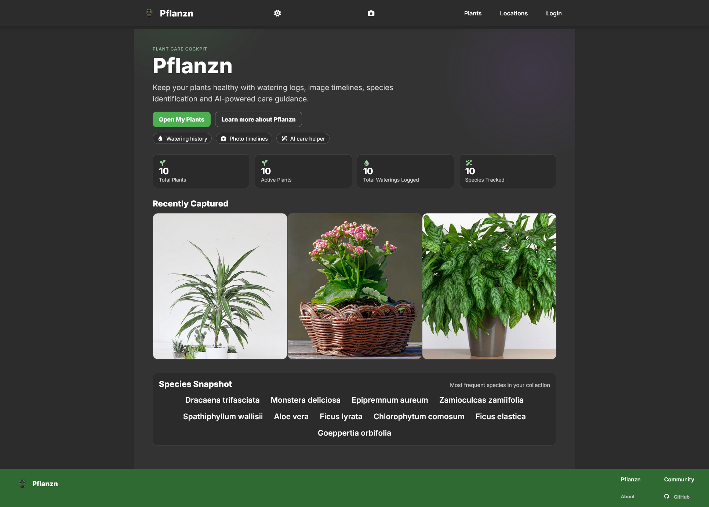
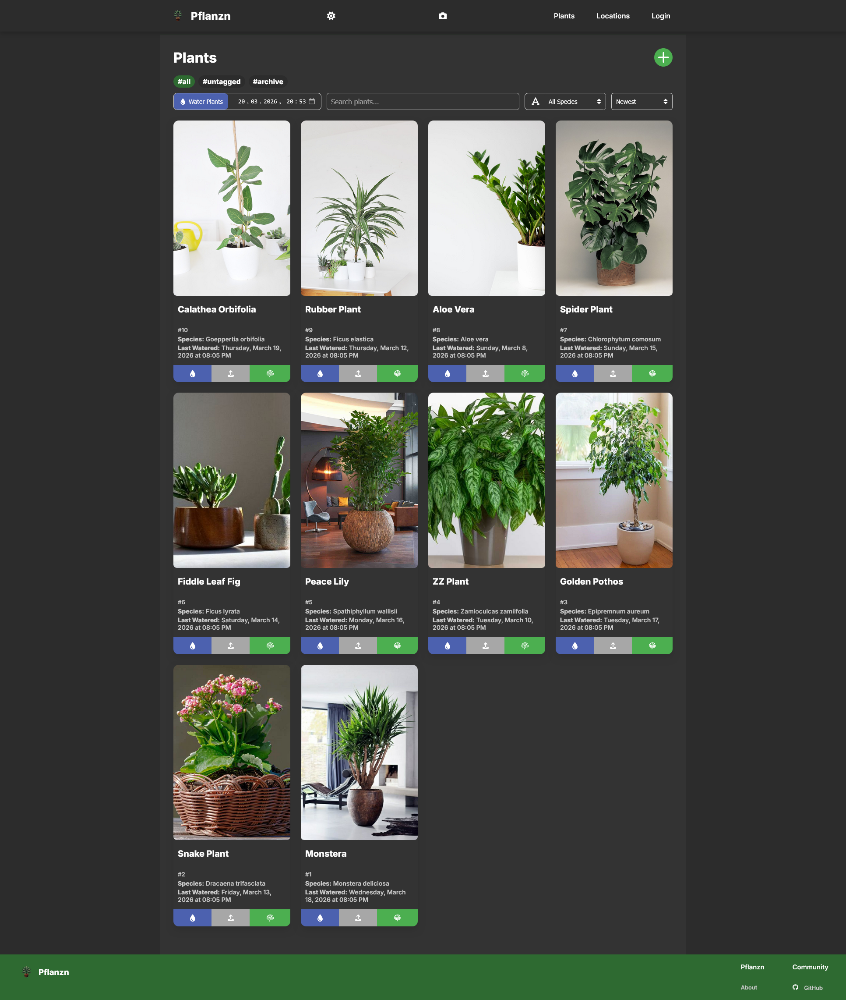
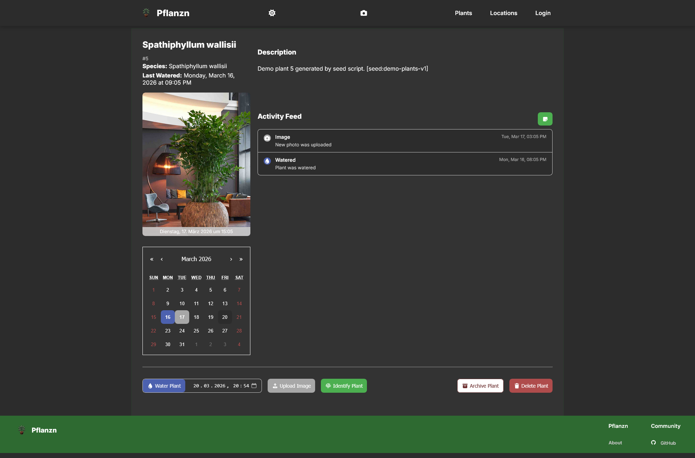
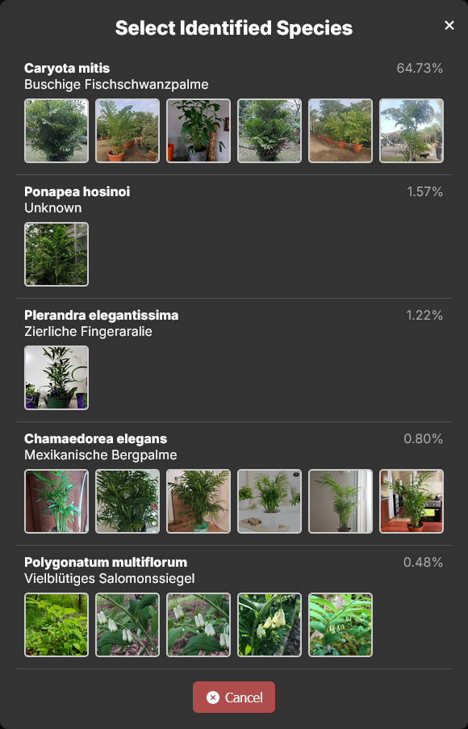
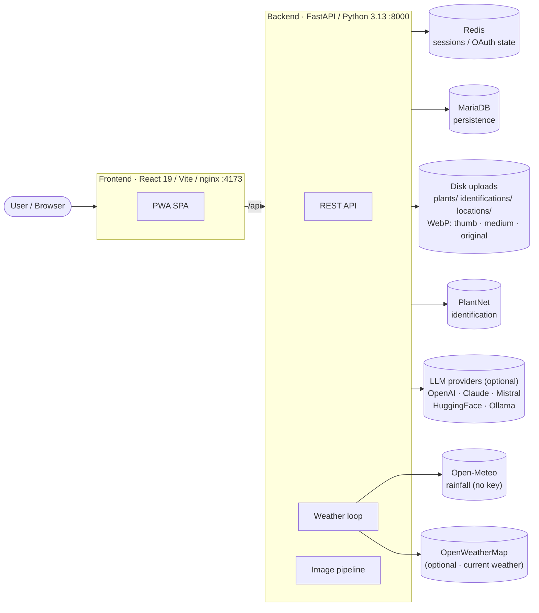

<p align="center"></p>

# Pflanzn

> Self-hostable plant management — track your collection, watering schedules, and species identification. Built as a PWA with mobile-first design and offline read access for cached data.

[](https://ko-fi.com/0x3e4)


(https://hecate.pw/scans)

---

<p align="center">
  
</p>

<details>
<summary><strong>More screenshots</strong> — plants list, plant detail, identification</summary>

<br/>

<table>
  <tr>
    <td width="50%"></td>
    <td width="50%"></td>
  </tr>
  <tr>
    <td align="center"><sub>Plants list</sub></td>
    <td align="center"><sub>Plant detail · timeline</sub></td>
  </tr>
  <tr>
    <td width="50%"></td>
    <td width="50%"></td>
  </tr>
  <tr>
    <td align="center"><sub>Species identification</sub></td>
    <td></td>
  </tr>
</table>

</details>

---

## Table of contents

- [Highlights](#highlights)
- [Architecture](#architecture)
- [Quick start](#quick-start)
- [Local development](#local-development)
- [Configuration](#configuration)
- [Tech stack](#tech-stack)
- [Demo](#demo)
- [Support](#support)

---

## Highlights

|     |     |
| --- | --- |
| **Catalogue** | Plants with photos, species info, care notes; tags and locations with GPS coordinates and an interactive Leaflet map. |
| **Tracking** | Watering, fertilizing, image, and care-advice timelines with calendar view and per-activity colour coding. |
| **Identification** | One-shot PlantNet integration — accepts JPG / PNG / WebP / HEIC; the backend normalises uploads to JPEG before forwarding. |
| **AI care advice** | Optional integration with OpenAI, Claude, Mistral, HuggingFace, or a local Ollama instance — provider auto-detected from whichever API key is set. |
| **Auto-watering** | Outdoor plants with `reaches_rain=true` are auto-watered when Open-Meteo reports rainfall above your threshold. Optional OpenWeatherMap key for current-weather display. |
| **PWA** | Installable on phone or desktop; Workbox runtime caching (CacheFirst for images, StaleWhileRevalidate for API, NetworkFirst for navigation). |
| **Sharing** | Token-based public collection links with a dedicated read-only view. |
| **Auth modes** | `no` (open), `local` (JWT + Argon2 + Redis sessions with theft detection), or `oidc` (external IdP). |
| **No telemetry** | No tracking. No ads. |

---

## Architecture



---

## Quick start

> [!NOTE]
> Requires Docker + Docker Compose. The compose file is gitignored — copy from the `.example` first.

```bash
cp .env.example .env
cp docker-compose.yml.example docker-compose.yml
# Edit .env with your settings (database, API keys, domain, etc.)
docker compose up -d --build
```

The app will be reachable at the domain you configured in `DOMAIN`. See [.env.example](.env.example) for all available settings.

Prebuilt images are also published to GHCR on every push to `main` ([build-images.yml](.github/workflows/build-images.yml)):

- `ghcr.io/0x3e4/pflanzn-backend`
- `ghcr.io/0x3e4/pflanzn-frontend` (multi-stage build → nginx alpine)

---

## Local development

### Frontend

```bash
cd frontend
pnpm install
pnpm run dev          # Vite dev server with hot reload
pnpm run build        # TypeScript check + production build
pnpm run lint         # ESLint
pnpm test             # Vitest
pnpm run test:watch   # Vitest in watch mode
```

Requires Node ≥ 24.

### Backend

The backend runs in Docker with `--reload`. For manual setup:

```bash
cd backend
poetry install
uvicorn app.main:app --host 0.0.0.0 --port 8000 --reload
```

Tests:

```bash
cd backend
poetry run pytest tests/ -v
```

### Linting

Pre-commit hooks (husky + lint-staged) run ESLint and Prettier on staged frontend files. The backend uses ruff:

```bash
poetry run ruff check backend/app/ --fix
```

---

## Configuration

Everything is driven through environment variables — see [.env.example](.env.example) for the full list. Frontend runtime configuration is fetched from `GET /api/config` so prebuilt images can be reconfigured per deployment without rebuilding.

| Category | Key variables |
| --- | --- |
| **General** | `SECRET_KEY`, `TZ`, `LOCALE`, `DOMAIN` |
| **Auth** | `AUTH_MODE` (`no` / `local` / `oidc`), `SHOW_PROTECTED_VIEW`, `ADMIN_USER`, `ADMIN_EMAIL`, `ADMIN_PASSWORD` |
| **OIDC** | `OIDC_NAME`, `OIDC_PROVIDER_URL`, `OIDC_CLIENT_ID`, `OIDC_CLIENT_SECRET` |
| **Database** | `DB_HOST`, `DB_PORT`, `DB_USER`, `DB_PASSWORD`, `DB_ROOT_PASSWORD`, `DB_NAME` |
| **Redis** | `REDIS_URL` |
| **Features** | `ENABLE_LOCATIONS` |
| **Identification** | `PLANTNET_API_KEY`, `PLANTNET_LANGUAGE` |
| **AI providers (optional)** | `LLM_LANGUAGE`, `OPENAI_API_KEY` / `OPENAI_MODEL_NAME`, `CLAUDE_API_KEY` / `CLAUDE_MODEL_NAME`, `MISTRALAI_API_KEY` / `MISTRALAI_API_URL` / `MISTRALAI_MODEL_NAME`, `HUGGINGFACE_API_KEY` / `HUGGINGFACE_MODEL_NAME`, `OLLAMA_URL` / `OLLAMA_MODEL_NAME`. Provider auto-detected from whichever key is set; priority `openai > claude > mistralai > huggingface > ollama`. |
| **Weather** | `WEATHER_ENABLED`, `WEATHER_CHECK_INTERVAL_HOURS`, `WEATHER_RAINFALL_THRESHOLD_MM`, `OPENWEATHERMAP_API_KEY` (optional) |

> [!NOTE]
> Legacy `VITE_*` names (`VITE_DOMAIN`, `VITE_AUTH_MODE`, …) still resolve as fallbacks in the backend, but they're misleading — these vars are read by the **backend** at runtime and exposed to the frontend via `/api/config`. Vite itself never sees them, so the prefix carries no meaning. New deployments should use the unprefixed names.

---

## Tech stack

| Component | Technology |
| --- | --- |
| Backend | Python 3.13, FastAPI, SQLAlchemy ORM, Uvicorn, Poetry |
| Database | MariaDB |
| Cache | Redis (sessions, OAuth state) |
| Frontend | React 19, TypeScript 6, Vite 8, React Router v7, pnpm |
| Production serving | nginx alpine (multi-stage Dockerfile, served on port 4173) |
| Auth | JWT (HS256), Argon2, OIDC (authlib), Redis-backed sessions with IP + User-Agent theft detection |
| Identification | PlantNet (HEIC / WebP / PNG / JPG accepted; normalised to JPEG before forwarding) |
| AI care helper | OpenAI · Claude · Mistral · HuggingFace · Ollama (factory-pattern, each optional) |
| Weather | Open-Meteo (rainfall, no key); OpenWeatherMap (optional, current weather display) |
| PWA | vite-plugin-pwa + Workbox (CacheFirst / StaleWhileRevalidate / NetworkFirst) |
| Image pipeline | Pillow + pillow_heif → 3 WebP variants per upload (`thumb` 300px, `medium` 800px, `original` 2000px) served via `?size=…` |
| Deployment | Docker Compose; GHCR images via [GitHub Actions](.github/workflows/build-images.yml) |

---

## Demo

A public demo is available at **[pflanzn.app](https://pflanzn.app)** — login with `admin` / `admin`. Data resets every 4 hours.

---

## Support

Pflanzn is built and maintained as a labour of love. If it makes your plant-care routine easier, a small tip keeps the lights on:

<a href="https://ko-fi.com/0x3e4" target="_blank"></a>

A star on the [GitHub repo](https://github.com/0x3e4/pflanzn) is just as welcome — bug reports and pull requests too.

<br>

<div align="center">
Made with ❤ in Austria
</div>
